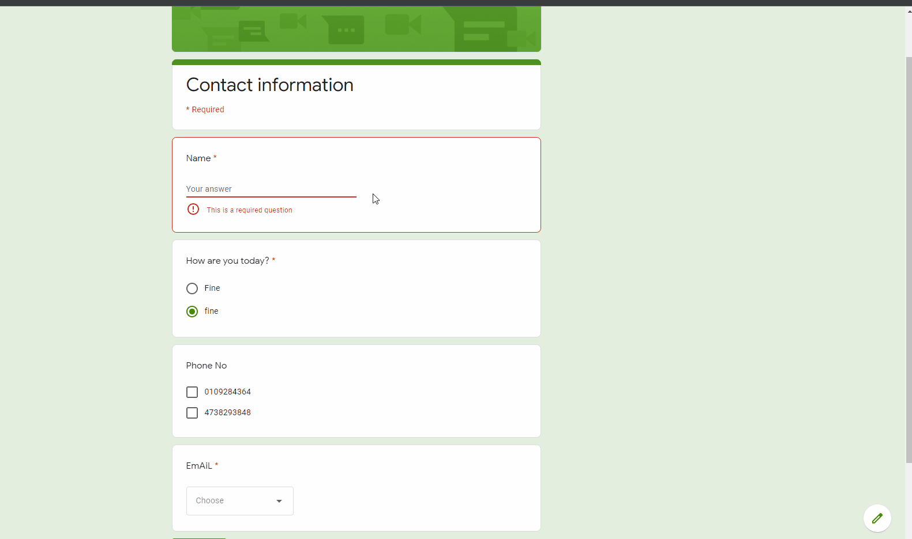
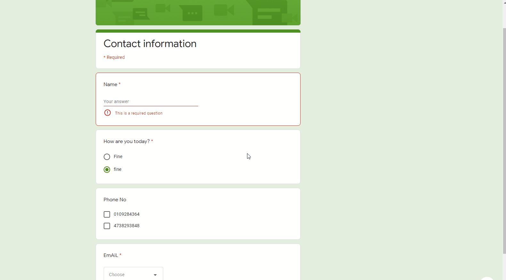
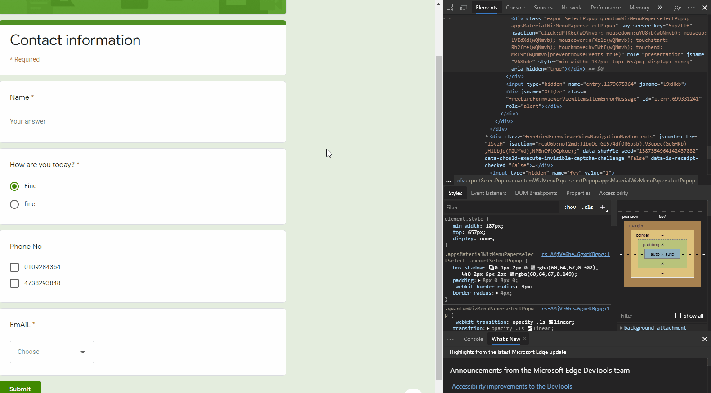
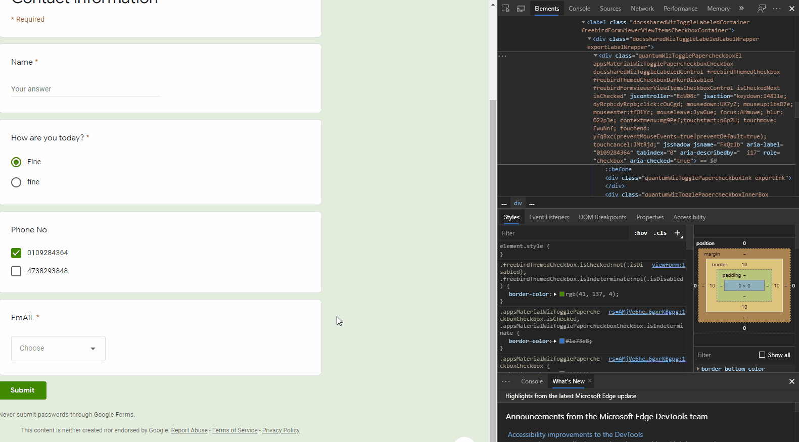
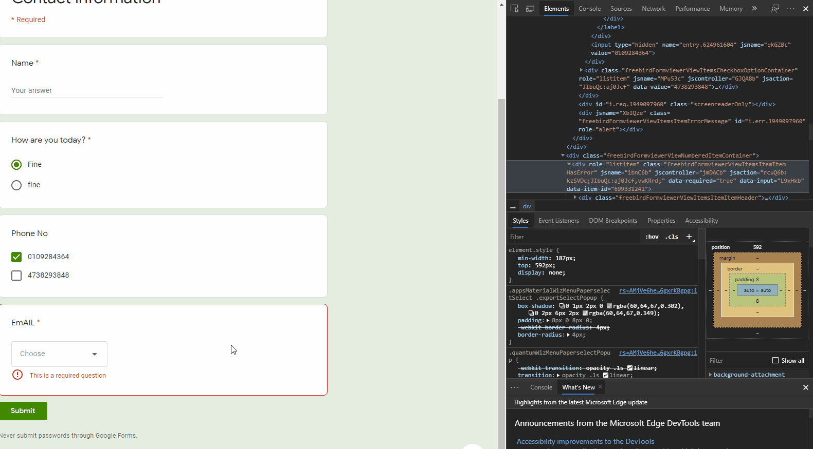
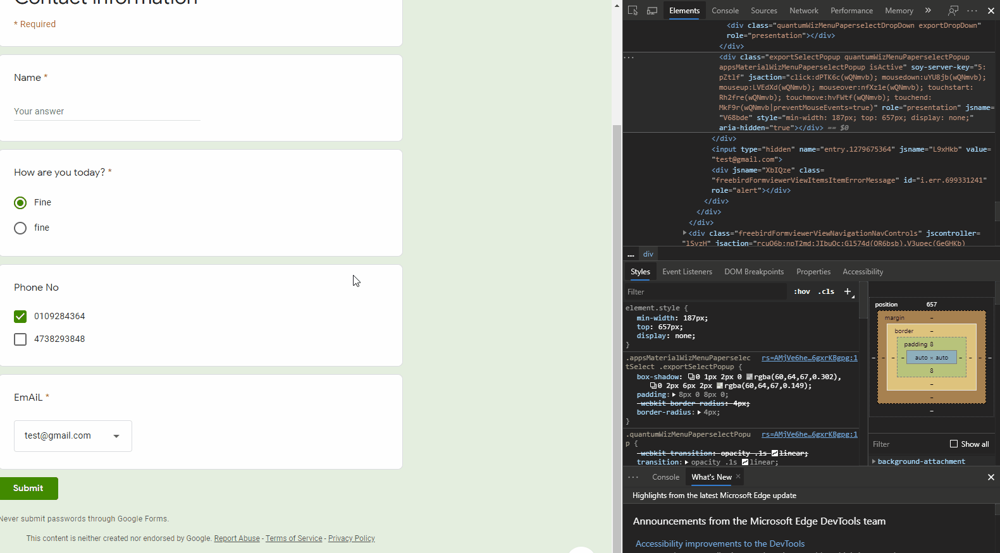

# AutoForm


[](https://www.python.org/)

This python script utilises Selenium to find elements in a form, fill them up accordingly and submit the form.<br/>
Tested with Google Form.

## Table of Contents
* [Setup](#setup)
* [Configuring the script](#configuring-the-script)
  - [Input Box](#eg1-input-box)
  - [Radio Button](#eg2-radio-button)
  - [Check Box](#eg3-check-box)
  - [Drop Down](#eg4-drop-down)
  - [Submit Button](#eg5-submit-button)

## Setup
Requests must be installed.
```bash
pip install requests
```

Selenium must be installed.
```bash
pip install selenium
```

Run script
```bash
python AutoForm.py
```

## Configuring the script
The variables in this script must be configured first to match that of your form.

### Eg.1 Input Box
To enter an input create a variable in the script with your desired input in quotes ' ':
```bash
name = 'Name goes here.'
```
Copy the xPath of the input box from the form using Inspect Element as shown below:

Paste the xPath into the script:
```bash
#xPaths of the form's components
input_Name = '//*[@id="mG61Hd"]/div/div/div[2]/div[1]/div/div[2]/div/div[1]/div/div[1]/input'
```

### Eg.2 Radio Button
Select the option listed on the radio buttons first, then copy the xPath of your chosen option as shown below:

Paste its xPath into the script. (same as Eg.1)

### Eg.3 Check Box
Basically the same procedure as the Radio Button. Copy and Paste.


### Eg.4 Drop Down 
Now this is a bit more complicated than the first 3 as there is 2 seperate parts.<br/>
Firstly, copy the xPath of the 'Choose' button then paste it into the script (Same as above):

Secondly, copy the xPath of your desired option and then paste it into the script by creating a new variable:


### Eg.5 Submit Button
Basically the same as those above, Copy and Paste:



